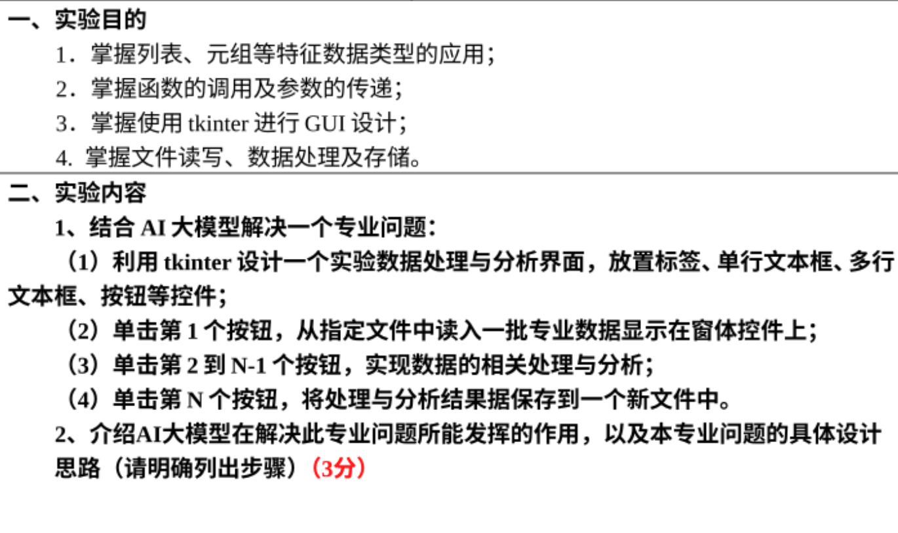

# python_work
我们的python作业

## 我们先处理第一个要求

+ 制作tkinter窗口
+ 按钮实现功能:
  - **输入** :  一个一元方程
  - **输出** :  点击按钮实现多个功能

+ 功能实现预期要求 :
     + 按钮一 : 显示函数图像
     + 按钮二 : 以牛顿割线的方法求零点 (如果有,无则输出无)
     + 按钮三 : 将函数求导
     + 按钮四 : 将函数积分
